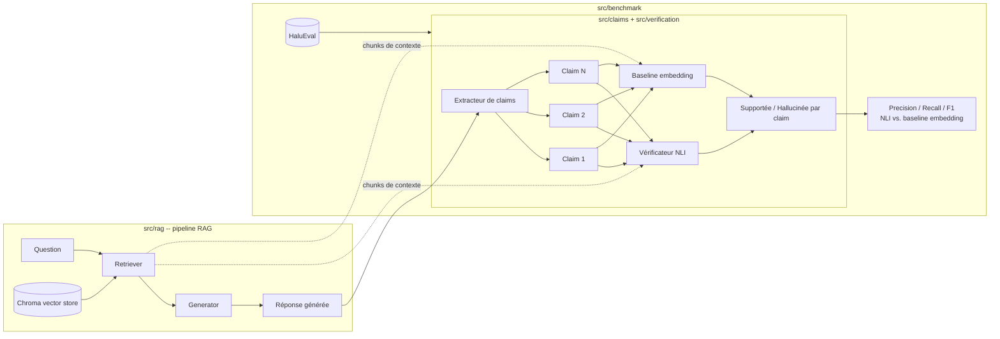

# RAGCheck -- Explication complète du projet (français)

Ce document explique **tout** le projet RAGCheck, du tout premier fichier créé
jusqu'aux résultats finaux du benchmark. Il est écrit pour que vous puissiez
comprendre chaque décision technique et être capable de la défendre en
entretien -- pas seulement savoir que "ça marche".

Les noms de fichiers, de modèles, de bibliothèques et les extraits de code
restent en anglais (ce sont des identifiants techniques), mais toutes les
explications sont en français.

---

## 1. Objectif du projet

RAGCheck est un **détecteur d'hallucinations pour les systèmes RAG**
(Retrieval-Augmented Generation). Concrètement, il prend en entrée :

- une **question**,
- des **documents récupérés** (le contexte fourni au modèle de génération),
- une **réponse générée** par un LLM à partir de ces documents,

et il vérifie, **affirmation par affirmation**, si chaque phrase de la réponse
est réellement soutenue par les documents récupérés -- ou si le modèle a
"halluciné" un fait qui n'apparaît pas dans le contexte.

### Pourquoi ce projet est intéressant

La plupart des démos RAG s'arrêtent à "je récupère des documents, je génère
une réponse". Le problème réellement intéressant (et souvent ignoré) est de
vérifier que ce qui est généré est **réellement ancré** dans ce qui a été
récupéré -- un modèle de génération peut halluciner même avec une recherche
documentaire parfaite. Ce projet construit un vérificateur au niveau de
l'affirmation ("claim") pour combler cet écart, et **mesure concrètement**
combien un vrai modèle d'inférence logique (NLI) apporte par rapport à la
solution la plus simple à laquelle la plupart des gens pensent en premier :
la similarité d'embeddings.

### Le résultat principal, tout de suite

Sur 100 exemples réels du jeu de données HaluEval (50 réponses correctes +
50 réponses hallucinées, parfaitement équilibrées) :

| métrique   | vérificateur NLI | baseline embedding |
|------------|:-----------------:|:--------------------:|
| accuracy   | 0.600              | 0.260                |
| precision  | 0.574              | 0.260                |
| recall     | **0.780**          | 0.260                |
| f1         | **0.661**          | 0.260                |

Le vérificateur NLI attrape **78 %** des vraies hallucinations ; la baseline
par similarité d'embeddings n'en attrape que **26 %** -- moins bien qu'un
tirage à pile ou face sur cet échantillon. C'est exactement la preuve que ce
projet cherchait à établir (voir section 8 pour le détail du benchmark).

---

## 2. Vue d'ensemble de l'architecture



Trois grands blocs, dans l'ordre où ils ont été construits :

1. **`src/rag/`** -- un pipeline RAG minimal qui sert de "générateur d'entrées"
   pour le vrai projet : il produit le triplet `(question, documents, réponse)`
   qu'on veut ensuite analyser.
2. **`src/claims/` + `src/verification/`** -- le cœur du projet : découper la
   réponse en affirmations atomiques, puis vérifier chacune contre les
   documents, avec deux méthodes différentes (une simple, une sophistiquée) à
   comparer.
3. **`src/benchmark/`** -- charge un jeu de données public étiqueté
   (hallucination oui/non) et mesure objectivement laquelle des deux méthodes
   de vérification fonctionne réellement mieux.

### Arborescence du projet

```
src/
  rag/            question -> documents -> réponse générée (FONCTIONNEL)
    corpus.py       charge le corpus de démo (rag-mini-wikipedia)
    chunking.py     découpe les documents en fragments ("chunks") avec chevauchement
    embedding.py    wrapper autour de sentence-transformers
    vectorstore.py  wrapper autour de ChromaDB (indexation + recherche)
    retriever.py    question -> top-k chunks les plus pertinents
    generator.py    question + chunks -> réponse (flan-t5 local, interchangeable)
    pipeline.py     orchestre tout ce qui précède
  claims/         réponse -> affirmations atomiques (FONCTIONNEL -- découpage par phrase)
    extractor.py
  verification/   affirmation + preuve -> supportée/hallucinée (FONCTIONNEL)
    nli_checker.py       vérification par inférence logique (NLI) -- le vrai cœur du projet
    embedding_checker.py baseline par similarité, pour comparaison
  benchmark/      évalue les deux vérificateurs sur un jeu de données étiqueté (FONCTIONNEL -- HaluEval)
    datasets.py     chargeur HaluEval (fonctionnel) ; chargeur RAGTruth (non implémenté)
    metrics.py      precision/recall/F1
    run_benchmark.py script d'évaluation de bout en bout
tests/            reflète src/ exactement, dossier par dossier
scripts/
  run_pipeline.py   démo interactive : question -> chunks + réponse + claims + vérification
config.yaml       noms de modèles, chemins, paramètres de chunking/recherche/vérification
.env.example      OPENAI_API_KEY (utile seulement si on bascule vers un backend payant)
```

---

## 3. Comment installer et exécuter le projet

```bash
python -m venv .venv
.venv\Scripts\activate        # Windows
pip install -r requirements.txt
```

**Démo interactive** -- fait tourner tout le pipeline (recherche, génération,
extraction de claims, vérification) pour une seule question :

```bash
python scripts/run_pipeline.py
python scripts/run_pipeline.py "Did Lincoln sign the National Banking Act of 1863?"
```

Le tout premier lancement télécharge le corpus, le modèle d'embedding et le
modèle de génération, puis construit un index Chroma persistant dans
`data/chroma_db/` -- cela prend une minute ou deux. Les lancements suivants
réutilisent cet index.

**Benchmark** -- évalue les deux vérificateurs sur des exemples HaluEval
étiquetés :

```bash
python -m src.benchmark.run_benchmark            # utilise sample_limit de config.yaml (50 lignes / 100 exemples par défaut)
python -m src.benchmark.run_benchmark --limit 200
```

**Tests** (rapides, sans téléchargement de modèle ni accès réseau) :

```bash
pytest
```

Les tests qui utilisent de vrais modèles / le réseau sont marqués
`integration` et ignorés par défaut :

```bash
pytest -m integration
```

---

## 4. Le récit complet : comment le projet a été construit, étape par étape

Le projet a été construit **de manière incrémentale**, une étape à la fois,
en testant réellement chaque morceau (pas seulement en écrivant du code et en
espérant que ça marche).

### Étape 0 -- Mise en place du squelette du projet

Avant d'écrire la moindre logique, on a mis en place :

- l'arborescence `src/{rag,claims,verification,benchmark}` avec des
  sous-modules clairs,
- un dossier `tests/` qui reflète exactement `src/`,
- `config.yaml` : **un seul endroit** où vivent tous les noms de modèles,
  chemins et paramètres, pour ne rien coder en dur dans le code source,
- `requirements.txt`, `.gitignore`, `.env.example`, `pytest.ini`,
- des fichiers **stubs** (juste des docstrings + `raise NotImplementedError`)
  pour `claims/extractor.py`, `verification/nli_checker.py`,
  `verification/embedding_checker.py` et tout `benchmark/` -- pour que la
  structure entière du projet soit visible dès le départ, même si rien
  n'était encore implémenté.

Cette étape ne contient aucune logique d'intelligence artificielle : c'est de
l'organisation pure. Mais elle est essentielle -- elle permet de construire le
reste "brique par brique" sans tout redessiner à chaque étape.

### Étape 1 -- Le pipeline RAG minimal (`src/rag/`)

**Objectif** : produire le triplet `(question, documents récupérés, réponse
générée)` qui sera analysé plus tard. Ce n'est **pas** le cœur du projet --
c'est juste le "générateur d'entrées" pour le vrai travail.

Le pipeline suit ces étapes :

1. **`corpus.py`** -- charge un petit corpus Wikipedia
   (`rag-datasets/rag-mini-wikipedia`, ~3200 passages) depuis HuggingFace.
   Ce corpus est **différent** du jeu de données de benchmark (HaluEval, voir
   étape 5) : HaluEval fournit déjà ses propres triplets
   `(question, contexte, réponse)`, donc il n'a pas besoin de notre moteur de
   recherche. Ce corpus Wikipedia sert uniquement à prouver que le pipeline
   RAG fonctionne, et à donner quelque chose à interroger dans la démo
   interactive.

2. **`chunking.py`** -- découpe chaque document en fragments ("chunks") de
   150 mots avec un chevauchement de 30 mots, via une simple séparation par
   nombre de mots (pas de découpage par phrase). Simple, facile à expliquer,
   suffisant pour ce corpus.

3. **`embedding.py`** -- transforme chaque fragment de texte en vecteur
   numérique avec `sentence-transformers/all-MiniLM-L6-v2` : un modèle
   d'embedding petit, rapide, qui tourne bien sur CPU, avec de bonnes
   performances de recherche pour sa taille.

4. **`vectorstore.py`** -- stocke ces vecteurs dans **ChromaDB**, une base de
   données vectorielle locale et persistante (pas besoin de service externe).

5. **`retriever.py`** -- étant donné une question, l'embed avec le même
   modèle, puis interroge ChromaDB pour récupérer les `top_k` fragments les
   plus proches (similarité cosinus).

6. **`generator.py`** -- étant donné la question + les fragments récupérés,
   génère une réponse avec **`google/flan-t5-base`**, exécuté **localement**
   via `transformers` (pas de clé API, pas de coût par appel). L'interface est
   écrite pour qu'on puisse facilement basculer vers un modèle hébergé
   (`openai`) plus tard sans toucher au reste du code -- ce backend `openai`
   est laissé comme un stub pour l'instant.

7. **`pipeline.py`** -- orchestre tout : construit l'index une seule fois
   (`ensure_index_built()`), puis répond à une question
   (`answer_question()`).

**Vérification réelle effectuée** : le script a été exécuté pour de vrai
(`scripts/run_pipeline.py`), pas juste écrit. Résultat concret observé :
pour la question *"What is the capital of Uruguay?"*, le système a récupéré
le bon passage ("Montevideo, Uruguay's capital...") et généré la bonne
réponse : **"Montevideo"**.

**Un bug rencontré et corrigé à cette étape** : la bibliothèque
`transformers` installée (version 5.9.0, très récente) avait supprimé la
tâche `"text2text-generation"` utilisée par l'API `pipeline()` de haut
niveau. Solution : charger directement le modèle avec
`AutoModelForSeq2SeqLM` + `AutoTokenizer` plutôt que de dépendre du nom de
tâche fragile. Un deuxième bug est apparu lors de l'affichage : le terminal
Windows par défaut (encodage `cp1252`) plantait sur certains caractères
accentués venant de Wikipedia -- corrigé en forçant l'encodage UTF-8 sur la
sortie standard (`sys.stdout.reconfigure(encoding="utf-8")`).

### Étape 2 -- Extraction des affirmations ("claims") (`src/claims/extractor.py`)

**Le problème que ça résout** : une réponse générée peut être en partie
correcte et en partie fausse. Vérifier la réponse entière comme un seul bloc
contre les documents pourrait manquer une clause hallucinée cachée dans une
phrase par ailleurs correcte. Il faut donc découper la réponse en unités
vérifiables indépendamment.

**Approche choisie -- découpage par phrase** : chaque phrase de la réponse
devient une "claim" (affirmation). Implémenté avec une expression régulière
qui coupe sur un signe de ponctuation de fin de phrase (`. ! ?`) suivi d'un
espace puis d'une majuscule/chiffre/guillemet.

**Pourquoi cette approche, et pas quelque chose de plus sophistiqué ?**

- **Aucune nouvelle dépendance** (pas de spaCy, pas de NLTK) -- reste
  transparent, facile à défendre en entretien : on peut montrer la règle
  exacte et expliquer pourquoi elle fonctionne et où elle échoue.
- **Limites connues et documentées, pas cachées** : elle ne découpe pas les
  phrases composées ("Lincoln était président et il a été assassiné en 1865"
  reste une seule affirmation, alors qu'elle contient deux faits distincts),
  et elle se trompe sur les abréviations ("Gen. Grant" est lu comme deux
  phrases). Un test (`test_abbreviation_mis_split_is_a_known_limitation`)
  documente ce comportement explicitement plutôt que de faire semblant qu'il
  est correct.
- **Interface compatible avec une amélioration future** : la classe `Claim`
  a deux champs, `text` et `source_sentence`. Aujourd'hui ils sont
  identiques, mais une future version basée sur un LLM (qui décompose une
  phrase complexe en plusieurs faits atomiques, comme dans la littérature
  RAGTruth / FActScore) pourrait produire plusieurs `Claim` par phrase source
  sans changer l'interface utilisée par le reste du code.

**Vérifié en conditions réelles** : sur une réponse longue générée par le
pipeline (à propos de la jeunesse de Lincoln), le découpage a correctement
produit 3 affirmations distinctes à partir des 3 phrases de la réponse.

### Étape 3 -- Baseline par similarité d'embeddings (`src/verification/embedding_checker.py`)

**Rôle** : c'est la méthode "naïve", celle à laquelle beaucoup de gens
pensent en premier pour vérifier une réponse RAG -- et celle que ce projet
cherche justement à dépasser.

**Fonctionnement** : on embed l'affirmation et chaque fragment de preuve avec
le même modèle d'embedding que la recherche (`all-MiniLM-L6-v2`), puis on
calcule la similarité cosinus. Si la meilleure similarité dépasse un seuil
(0.5 par défaut, dans `config.yaml`), l'affirmation est jugée "supportée".

**Pourquoi cette baseline existe** : pour démontrer concrètement *pourquoi*
la simple similarité ne suffit pas. Une affirmation peut être sémantiquement
proche d'un fragment portant sur le même sujet tout en affirmant quelque
chose que ce fragment ne dit pas -- voire qu'il contredit.

### Étape 4 -- Le vérificateur NLI (`src/verification/nli_checker.py`) -- le vrai cœur du projet

**Le principe** : au lieu de mesurer une simple similarité de surface, on
utilise un modèle d'**inférence en langage naturel** (NLI, Natural Language
Inference). Ce type de modèle prend une paire `(prémisse, hypothèse)` et
répond : est-ce que la prémisse **implique logiquement** ("entailment")
l'hypothèse, la **contredit** ("contradiction"), ou est-ce **neutre** (ni
l'un ni l'autre) ?

Ici : la prémisse est le fragment de preuve, l'hypothèse est l'affirmation à
vérifier.

**Modèle choisi -- `cross-encoder/nli-deberta-v3-base`** : un modèle
DeBERTa-v3 entraîné spécifiquement pour la classification NLI à 3 classes
(entailment / neutral / contradiction) sur MNLI + SNLI + FEVER, chargé via
la classe `CrossEncoder` de `sentence-transformers`. Contrairement au modèle
d'embedding (qui encode chaque texte séparément), un `CrossEncoder` regarde
les deux textes **ensemble** en une seule passe -- beaucoup plus précis pour
ce genre de comparaison fine, mais aussi plus coûteux en calcul (on ne peut
pas pré-calculer les vecteurs à l'avance).

**L'exemple concret qui prouve l'intérêt du projet** :

Étant donné la preuve *"Abraham Lincoln was the sixteenth President of the
United States..."* :

| affirmation | similarité embedding | verdict NLI |
|---|---|---|
| "Lincoln was the sixteenth President." | 0.79 (supportée) | **entailment** (99.6 %) |
| "Lincoln was the **seventeenth** President." | 0.71 (**toujours "supportée" !**) | **contradiction** (99.9 %) |

En changeant un seul mot ("sixteenth" -> "seventeenth"), l'affirmation reste
quasiment identique sur le plan lexical et sémantique -- mêmes entités, même
structure de phrase -- donc la similarité d'embeddings bouge à peine et reste
au-dessus du seuil de 0.5. Le modèle NLI, lui, comprend la relation logique
réelle entre les deux phrases et détecte correctement la contradiction. **Ce
cas exact est vérifié par un test automatisé**
(`tests/verification/test_nli_checker.py` et
`tests/verification/test_embedding_checker.py`), pas juste montré une fois à
la main.

### Le bug découvert en cours de route, et sa correction (une histoire importante à raconter en entretien)

En testant la démo sur une réponse plus longue (plusieurs phrases sur la
jeunesse de Lincoln), un résultat surprenant est apparu : des affirmations
**vraies**, copiées mot pour mot d'un fragment récupéré, étaient classées
**"neutral"** par le modèle NLI au lieu de "entailment", avec une confiance
de 100 %.

**Investigation** : le fragment de preuve utilisé comme prémisse faisait
~144 mots (plusieurs phrases). Un test isolé a montré que :

- la même affirmation contre **une seule phrase** (celle d'où elle venait
  exactement) obtenait 98.7 % d'entailment,
- la même affirmation contre **le fragment entier** (144 mots, plusieurs
  phrases) obtenait seulement 0.3 % d'entailment (99.7 % "neutral").

**Explication** : les modèles NLI de type cross-encoder sont entraînés sur
des paires **phrase contre phrase** (SNLI, MNLI, FEVER). Quand on leur donne
un paragraphe entier de plusieurs phrases comme prémisse, le signal
d'entailment se dilue à cause des phrases voisines qui parlent d'autre chose.
C'est un phénomène documenté dans la littérature sur la vérification de
cohérence factuelle (notamment l'article **SummaC**, Laban et al. 2022), qui
recommande justement de décomposer les preuves en phrases individuelles.

**Correction appliquée** : le vérificateur NLI découpe maintenant chaque
fragment de preuve en phrases individuelles (en réutilisant la même fonction
`split_into_sentences()` que l'extracteur de claims, pour ne pas dupliquer la
logique), puis compare l'affirmation à **chaque phrase de chaque fragment**
séparément, en gardant la meilleure. On garde une trace de quel fragment
d'origine a produit la meilleure phrase, pour toujours pouvoir répondre "quel
document soutient cette affirmation ?".

**Impact mesuré, pas supposé** : après correction, les nombres du benchmark
se sont réellement améliorés :

- accuracy : 0.500 -> **0.600**
- f1 : 0.609 -> **0.661**

C'est un bon exemple de méthode de travail à mentionner en entretien :
observer un comportement suspect, formuler une hypothèse, la vérifier
empiriquement avec un script isolé, la relier à la littérature existante,
corriger, puis **remesurer** pour confirmer l'amélioration -- plutôt que de
supposer que ça marche.

### Étape 5 -- Chargement du jeu de données de benchmark (`src/benchmark/datasets.py`)

**Choix du dataset -- HaluEval plutôt que RAGTruth (pour cette première
version)** :

- **HaluEval** (`pminervini/HaluEval`, configuration `qa`) est directement
  chargeable via `datasets.load_dataset()`, avec un schéma documenté et
  propre : chaque ligne contient
  `{knowledge, question, right_answer, hallucinated_answer}`. Cette
  structure "réponse correcte / réponse hallucinée" appariée donne
  gratuitement un benchmark binaire parfaitement équilibré -- idéal pour
  comparer proprement les deux vérificateurs.
- **RAGTruth** est distribué sous forme de fichiers JSON bruts sur GitHub
  (annotations au niveau du mot/segment), sans dataset HuggingFace propre et
  documenté. L'intégrer demanderait un parseur sur mesure -- c'est resté un
  stub (`load_ragtruth()` lève `NotImplementedError`), une décision de
  périmètre assumée et documentée plutôt qu'un oubli.

Pour chaque ligne source de HaluEval, on génère **deux** exemples de
benchmark : un avec la `right_answer` (`is_hallucinated=False`), un avec la
`hallucinated_answer` (`is_hallucinated=True`), tous deux partageant la même
question et le même contexte -- ce qui permet une comparaison appariée, pas
seulement des statistiques agrégées.

### Étape 6 -- Métriques et script de benchmark (`src/benchmark/metrics.py`, `src/benchmark/run_benchmark.py`)

**`metrics.py`** calcule accuracy, precision, recall et F1 (via
scikit-learn), en traitant "hallucinée" comme la classe positive -- c'est
celle qu'on cherche réellement à détecter.

**`run_benchmark.py`** orchestre tout le pipeline d'évaluation :

1. Charge N exemples HaluEval étiquetés.
2. Pour chaque exemple, extrait les affirmations de la réponse
   (`extract_claims`).
3. Vérifie chaque affirmation contre le contexte avec **les deux**
   vérificateurs (NLI et embedding).
4. Une réponse est prédite "hallucinée" si **au moins une** de ses
   affirmations n'est pas supportée -- ce qui correspond au niveau de
   granularité des étiquettes de HaluEval (une étiquette par réponse
   entière, pas par affirmation).
5. Calcule et affiche un tableau comparatif des deux vérificateurs.

---

## 5. Résultats finaux du benchmark, avec leur interprétation honnête

Reproductible avec `python -m src.benchmark.run_benchmark --limit 50`
(100 exemples au total).

| métrique   | vérificateur NLI | baseline embedding |
|------------|:-----------------:|:--------------------:|
| accuracy   | 0.600              | 0.260                |
| precision  | 0.574              | 0.260                |
| recall     | 0.780              | 0.260                |
| f1         | 0.661              | 0.260                |

**Ce que ça prouve** : l'inférence NLI surpasse nettement la similarité
d'embeddings sur cette tâche, sur cet échantillon -- c'est exactement la
raison d'être du vérificateur plus sophistiqué.

**Ce que ça ne prouve pas (encore)** : une precision de 0.574 pour le
vérificateur NLI signifie que plus d'un tiers de ses alertes d'hallucination
sont fausses. 50 lignes sources (100 exemples) restent un échantillon petit
et pas forcément représentatif. Aucun des deux seuils
(`entailment_threshold` / `embedding_similarity_threshold`, tous deux à 0.5
par défaut dans `config.yaml`) n'a été **calibré** sur un jeu de validation
séparé -- c'est la prochaine étape naturelle avant de présenter ces chiffres
comme plus qu'un résultat directionnel.

---

## 6. Limites connues (assumées et documentées, pas cachées)

- **Le découpage par phrase ne décompose pas les phrases composées.**
  "Lincoln était président et il a été assassiné en 1865" reste une seule
  affirmation alors qu'elle contient deux faits séparés ; une hallucination
  dans la seconde moitié pourrait être masquée par la véracité de la
  première.
- **Les réponses courtes ("yes"/"no") perdent le contexte de la question.**
  Sur une question fermée, flan-t5-base répond parfois littéralement "yes" --
  qui devient alors l'affirmation entière, sans référence à ce à quoi elle
  répond. Vérifier "yes" contre un passage biographique sur Lincoln ne teste
  pas grand-chose de significatif. Corriger ce point demanderait de composer
  l'affirmation à partir de la question **et** de la réponse, pas de la
  réponse seule -- pas encore implémenté.
- **Le modèle NLI confond "sans rapport" et "contradiction".** Il a été
  entraîné sur des paires prémisse/hypothèse qui portent sur le même sujet
  (la convention MNLI : "neutral" signifie "lié mais pas complètement
  impliqué", pas "sans rapport du tout"). Face à une paire réellement sans
  rapport, il prédit "contradiction" avec grande confiance au lieu de
  "neutral" (vérifié empiriquement). Le risque est limité ici car les
  fragments de preuve viennent toujours d'une recherche ancrée sur la
  question, mais l'ampleur exacte de cet effet sur les chiffres du benchmark
  reste une question ouverte.
- **Les seuils sont des valeurs par défaut non calibrées** (0.5 partout).
- **RAGTruth n'est pas implémenté** (`load_ragtruth()` reste un stub) --
  HaluEval a suffi pour établir la comparaison dans un premier temps.

---

## 7. Récapitulatif des choix techniques clés (pour un entretien)

| Décision | Choix fait | Raison principale |
|---|---|---|
| Corpus de démo | `rag-datasets/rag-mini-wikipedia` | Petit, propre, prêt pour du RAG ; distinct du jeu de benchmark |
| Modèle d'embedding | `sentence-transformers/all-MiniLM-L6-v2` | Rapide, léger, tourne bien sur CPU |
| Génération de réponse | `google/flan-t5-base`, en local | Aucune clé API, aucun coût, interface interchangeable |
| Base vectorielle | ChromaDB | Simple, locale, persistante, pas de service externe |
| Extraction de claims | Découpage par phrase (regex) | Aucune dépendance ajoutée, limites explicites et testées |
| Modèle NLI | `cross-encoder/nli-deberta-v3-base` | Spécialisé pour l'entailment à 3 classes, rapide sur CPU |
| Granularité de la preuve NLI | Phrase par phrase, pas fragment entier | Corrige un bug mesuré : le signal NLI s'effondre sur de longues prémisses |
| Jeu de données de benchmark | HaluEval (`pminervini/HaluEval`, config `qa`) | Chargement propre via `datasets`, paires supportée/hallucinée déjà équilibrées |
| Seuils de décision | 0.5 par défaut, dans `config.yaml` | Valeur naturelle pour un softmax à 3 classes ; non calibrée -- limite assumée |

---

## 8. Et après ? (prochaines étapes naturelles)

- Calibrer les seuils (`entailment_threshold`, `contradiction_threshold`,
  `embedding_similarity_threshold`) sur un jeu de validation séparé plutôt
  que de garder la valeur par défaut 0.5.
- Corriger le problème des réponses courtes en composant l'affirmation à
  partir de la question + réponse, pas de la réponse seule.
- Explorer une décomposition des affirmations basée sur un LLM (au lieu du
  simple découpage par phrase), pour gérer les phrases composées.
- Implémenter le chargeur RAGTruth pour comparer les résultats sur un
  deuxième jeu de données, avec des étiquettes au niveau du segment plutôt
  que de la réponse entière.
- Faire tourner le benchmark sur un échantillon plus large que 50 lignes
  pour des statistiques plus robustes.
