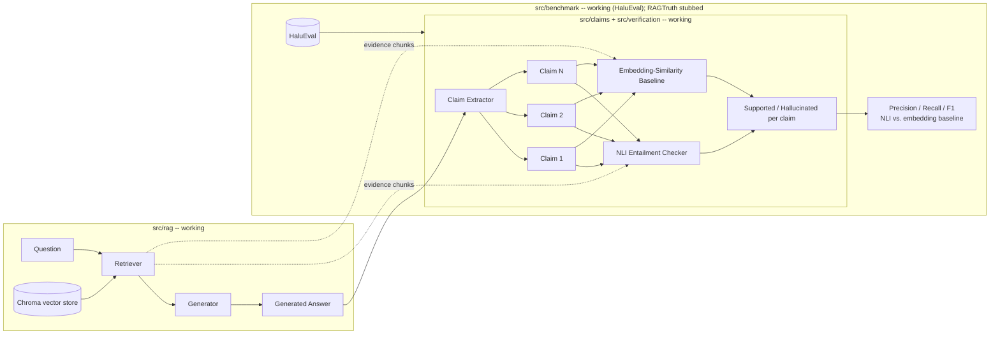

# RAGCheck -- Hallucination Detector for RAG Systems

A system that takes `(question, retrieved documents, generated answer)` and
checks whether each claim in the answer is actually supported by the
retrieved documents, using NLI-based entailment checking. It's benchmarked
against a public hallucination dataset (HaluEval) and compared against a
simpler embedding-similarity baseline.

This is a portfolio project, built incrementally.

## Why this project

Most RAG demos stop at "retrieve + generate." The interesting (and
underserved) problem is verifying that what got generated is actually
*grounded* in what got retrieved -- generation can still hallucinate even
with perfect retrieval. This project builds a claim-level verifier for
that gap, and measures how much a real entailment model (NLI) buys you
over the cheap embedding-similarity check most people reach for first.

**The headline result, on 100 HaluEval QA examples** (50 correct + 50
hallucinated answers, exactly balanced):

| metric    | NLI checker | embedding baseline |
|-----------|:-----------:|:-------------------:|
| accuracy  | 0.600       | 0.260               |
| precision | 0.574       | 0.260               |
| recall    | **0.780**   | 0.260               |
| f1        | **0.661**   | 0.260               |

The NLI checker catches 78% of real hallucinations; the embedding baseline
catches 26% -- worse than flipping a coin on this sample. See
[Benchmark results](#benchmark-results) below for how to reproduce this and
what it does/doesn't prove.

## Architecture



## Project layout

```
src/
  rag/            question -> retrieved chunks -> generated answer (WORKING)
    corpus.py       loads the demo corpus (rag-mini-wikipedia)
    chunking.py     splits documents into overlapping word-count chunks
    embedding.py    sentence-transformers wrapper
    vectorstore.py  ChromaDB wrapper (index + query)
    retriever.py    question -> top-k chunks
    generator.py    question + chunks -> answer (local flan-t5, swappable)
    pipeline.py     orchestrates the above
  claims/         answer -> atomic claims (WORKING -- sentence-level baseline)
    extractor.py
  verification/   claim + evidence -> supported/hallucinated (WORKING)
    nli_checker.py       NLI-based entailment (the actual project)
    embedding_checker.py similarity-based baseline for comparison
  benchmark/      score checkers against a labeled dataset (WORKING -- HaluEval)
    datasets.py     HaluEval loader (working); RAGTruth loader (stub)
    metrics.py      precision/recall/F1
    run_benchmark.py end-to-end evaluation script
tests/            mirrors src/ 1:1
scripts/
  run_pipeline.py   interactive end-to-end demo: question in -> retrieved
                     chunks + answer + extracted claims + verification out
config.yaml       model names, paths, chunking/retrieval/verification params
.env.example      OPENAI_API_KEY (only needed if generation backend is swapped)
```

## Setup

```bash
python -m venv .venv
.venv\Scripts\activate        # Windows
pip install -r requirements.txt
```

## Usage

**Interactive demo** -- retrieve, generate, extract claims, verify, all for
one question:
```bash
python scripts/run_pipeline.py
python scripts/run_pipeline.py "Did Lincoln sign the National Banking Act of 1863?"
```
First run downloads the corpus, embedding model, and generation model, then
builds a persistent Chroma index under `data/chroma_db/` -- this takes a
minute or two. Later runs reuse it.

**Benchmark** -- score both checkers against labeled HaluEval examples:
```bash
python -m src.benchmark.run_benchmark            # config.yaml's default sample_limit (50 rows / 100 examples)
python -m src.benchmark.run_benchmark --limit 200
```

**Tests** (fast, no network/model downloads):
```bash
pytest
```
Tests that hit real models/network are marked `integration` and skipped by
default:
```bash
pytest -m integration
```

## Key choices

- **Demo corpus -- `rag-datasets/rag-mini-wikipedia`**: a small (~3.2k
  passage), pre-chunked Wikipedia corpus with a matching QA set, built
  specifically for demoing RAG. It is *not* the benchmark dataset -- HaluEval
  (loaded in `src/benchmark/`) already ships its own labeled
  `(question, context, answer)` triples and doesn't need our retriever at
  all. This corpus exists purely to prove the RAG pipeline itself works
  end-to-end, and to give the interactive demo something to query.
- **Embedding model -- `sentence-transformers/all-MiniLM-L6-v2`**: small,
  fast, CPU-friendly, strong retrieval quality for its size. Used for both
  retrieval and the embedding-similarity baseline checker.
- **Generation -- local `google/flan-t5-base`**: runs on-device via
  `transformers`, no API key or per-call cost. The interface (`generator.py`)
  is written so this can be swapped for a hosted model later (an `openai`
  backend is stubbed) without touching any other module.
- **Vector store -- ChromaDB**: simplest persistent local vector DB to set
  up, no external service required.
- **Claim extraction -- regex sentence splitting**: each sentence in the
  generated answer becomes one claim. No new dependency (no spaCy/NLTK),
  easy to reason about, and a deliberately weak baseline -- see
  [Known limitations](#known-limitations).
- **NLI model -- `cross-encoder/nli-deberta-v3-base`**: a DeBERTa-v3 model
  fine-tuned directly for 3-way NLI (entailment/neutral/contradiction) on
  MNLI+SNLI+FEVER, loaded via sentence-transformers' `CrossEncoder`. Scores a
  `(premise, hypothesis)` pair in one forward pass -- this is the actual
  mechanism that catches what similarity can't (see the worked example
  below).
- **Evidence is decomposed into sentences before NLI scoring, not passed
  as whole chunks.** Found empirically: a claim that is a verbatim sentence
  from a retrieved ~150-word chunk scored 98.7% entailment against just
  that sentence, but only 0.3% against the full chunk containing it --
  cross-encoder NLI models are trained on single-sentence pairs and the
  signal collapses on multi-sentence premises. Fixed by reusing
  `src/claims/extractor.py`'s sentence splitter on evidence chunks too
  (see `src/verification/nli_checker.py`'s docstring), matching the
  approach used in factual-consistency research (SummaC, Laban et al.
  2022). This measurably improved the benchmark numbers above (accuracy
  0.500 -> 0.600, f1 0.609 -> 0.661).
- **Benchmark dataset -- HaluEval (`pminervini/HaluEval`, `qa` config)**:
  chosen over RAGTruth for the first implementation because it's directly
  loadable via `datasets.load_dataset()` with a documented schema
  (`{knowledge, question, right_answer, hallucinated_answer}`), and its
  right/hallucinated pairing gives an exactly balanced binary benchmark for
  free. RAGTruth remains a stub (`src/benchmark/datasets.py`'s
  `load_ragtruth()`) -- it ships as raw JSON on GitHub with span-level
  labels, not a documented HF dataset, so it needs a custom parser.

## The core idea, worked example

This is the case the whole project is built around. Given the evidence
"*Abraham Lincoln was the sixteenth President of the United States...*":

| claim | embedding similarity | NLI verdict |
|---|---|---|
| "Lincoln was the sixteenth President." | 0.79 (supported) | **entailment** (99.6%) |
| "Lincoln was the **seventeenth** President." | 0.71 (**still "supported"**) | **contradiction** (99.9%) |

Swapping one word keeps the claim topically identical to the evidence --
same entities, same sentence structure -- so embedding similarity barely
moves and stays above the 0.5 threshold. The NLI model reads the actual
relationship between the two sentences and correctly flags the
contradiction. This exact case is asserted in
[tests/verification/test_nli_checker.py](tests/verification/test_nli_checker.py)
and
[tests/verification/test_embedding_checker.py](tests/verification/test_embedding_checker.py).

## Benchmark results

Reproduce with `python -m src.benchmark.run_benchmark --limit 50` (default).
An answer is scored "predicted hallucinated" if *any* of its extracted
claims comes back unsupported -- matching HaluEval's one-label-per-answer
granularity.

| metric    | NLI checker | embedding baseline |
|-----------|:-----------:|:-------------------:|
| accuracy  | 0.600       | 0.260               |
| precision | 0.574       | 0.260               |
| recall    | 0.780       | 0.260               |
| f1        | 0.661       | 0.260               |

**What this does show**: NLI-based entailment substantially outperforms
embedding similarity at this task, on this sample -- the whole reason to
build the fancier checker.

**What this doesn't show (yet)**: NLI's own precision (0.574) means over a
third of its hallucination flags are wrong, and 50 examples is a small,
unrepresentative sample. Neither checker's threshold (`config.yaml`'s
`verification.entailment_threshold` / `embedding_similarity_threshold`,
both currently a default 0.5) has been *tuned* against a held-out validation
split -- that's the natural next step before quoting these numbers as
anything more than a directional result.

## Known limitations

- **Sentence-splitting claim extraction doesn't decompose compound
  sentences.** "Lincoln was president and was assassinated in 1865" stays
  one claim even though it asserts two separate facts; a hallucination in
  the second half could be masked by the first half being true. See
  `src/claims/extractor.py`'s docstring for the planned LLM-based
  decomposition upgrade.
- **Terse answers lose the question's context.** Run the demo on a yes/no
  question and the generated answer is often literally "yes" -- which
  becomes the entire claim, with no reference to what it's answering
  "yes" *to*. NLI checking "yes" against a Lincoln biography passage isn't
  really testing anything meaningful. Fixing this means composing the claim
  from the question + answer together, not the answer alone -- not yet
  implemented.
- **The NLI model conflates "unrelated" with "contradiction."** It was
  trained on premise/hypothesis pairs that are topically related (MNLI's
  convention: "neutral" means related-but-not-entailed, not unrelated).
  Given a genuinely unrelated pair, it confidently predicts contradiction
  instead of neutral (verified empirically -- see
  `src/verification/nli_checker.py`'s docstring). The risk is bounded here
  because evidence chunks always come from retrieval anchored to the
  question, but it's an open question exactly how much this affects the
  benchmark numbers above.
- **Thresholds are un-tuned defaults**, as noted above.
- **RAGTruth is not implemented** (`load_ragtruth()` is a stub) -- HaluEval
  was enough to prove the comparison out first.

## Current progress

- [x] Project scaffolding (folders, config, requirements, tests skeleton)
- [x] Step 1: RAG pipeline (chunk -> embed -> store -> retrieve -> generate)
- [x] Step 2: claim extraction (`src/claims/extractor.py`) -- sentence-splitting baseline
- [x] Step 3: embedding-similarity baseline (`src/verification/embedding_checker.py`)
- [x] Step 4: NLI-based entailment checker (`src/verification/nli_checker.py`)
- [x] Step 5: HaluEval loader (`src/benchmark/datasets.py`) -- RAGTruth still stubbed
- [x] Step 6: metrics + benchmark runner (`src/benchmark/metrics.py`, `run_benchmark.py`)
- [ ] Next: tune thresholds against a held-out split; fix the terse-answer /
      question-context gap; consider LLM-based claim decomposition; RAGTruth loader
