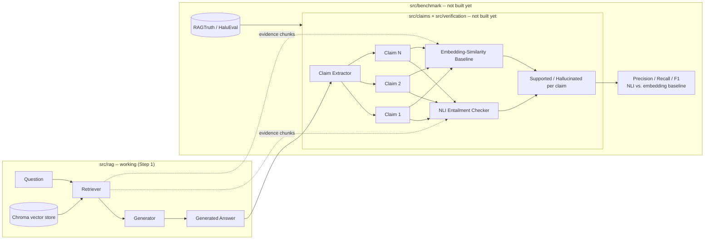

# RAGCheck -- Hallucination Detector for RAG Systems

A system that takes `(question, retrieved documents, generated answer)` and
checks whether each claim in the answer is actually supported by the
retrieved documents, using NLI-based entailment checking. It's benchmarked
against a public hallucination dataset (RAGTruth or HaluEval) and compared
against a simpler embedding-similarity baseline.

This is a portfolio project built incrementally, one step at a time.

## Why this project

Most RAG demos stop at "retrieve + generate." The interesting (and
underserved) problem is verifying that what got generated is actually
*grounded* in what got retrieved -- generation can still hallucinate even
with perfect retrieval. This project builds a claim-level verifier for
that gap, and measures how much a real entailment model (NLI) buys you
over the cheap embedding-similarity check most people reach for first.

## Architecture



## Project layout

```
src/
  rag/            question -> retrieved chunks -> generated answer (WORKING)
    corpus.py       loads the demo corpus (rag-mini-wikipedia)
    chunking.py     splits documents into overlapping word-count chunks
    embedding.py    sentence-transformers wrapper
    vectorstore.py  ChromaDB wrapper (index + query)
    retriever.py    question -> top-k chunks
    generator.py    question + chunks -> answer (local flan-t5, swappable)
    pipeline.py     orchestrates the above
  claims/         answer -> atomic claims (STUB)
    extractor.py
  verification/   claim + evidence -> supported/hallucinated (STUB)
    nli_checker.py       NLI-based entailment (the actual project)
    embedding_checker.py similarity-based baseline for comparison
  benchmark/      score checkers against a labeled dataset (STUB)
    datasets.py     RAGTruth / HaluEval loaders
    metrics.py      precision/recall/F1
    run_benchmark.py end-to-end evaluation script
tests/            mirrors src/ 1:1
scripts/
  run_pipeline.py   end-to-end demo: question in -> chunks + answer out
config.yaml       model names, paths, chunking/retrieval params
.env.example      OPENAI_API_KEY (only needed if generation backend is swapped)
```

## Setup

```bash
python -m venv .venv
.venv\Scripts\activate        # Windows
pip install -r requirements.txt
```

## Usage (Step 1 -- the RAG pipeline)

```bash
python scripts/run_pipeline.py
python scripts/run_pipeline.py "Did Lincoln sign the National Banking Act of 1863?"
```

First run downloads the corpus, the embedding model, and the local
generation model, then builds a persistent Chroma index under
`data/chroma_db/` -- this takes a minute or two. Later runs reuse it.

Tests (fast, no network/model downloads):
```bash
pytest
```
Tests that hit real models/network are marked `integration` and skipped by
default:
```bash
pytest -m integration
```

## Key choices so far

- **Demo corpus -- `rag-datasets/rag-mini-wikipedia`**: a small (~3.2k
  passage), pre-chunked Wikipedia corpus with a matching QA set, built
  specifically for demoing RAG. It is *not* the benchmark dataset --
  RAGTruth/HaluEval (loaded later in `src/benchmark/`) already ship their
  own labeled `(question, context, answer)` triples and don't need our
  retriever at all. This corpus exists purely to prove the RAG pipeline
  itself works end-to-end.
- **Embedding model -- `sentence-transformers/all-MiniLM-L6-v2`**: small,
  fast, CPU-friendly, strong retrieval quality for its size. A standard
  default for this kind of demo.
- **Generation -- local `google/flan-t5-base`**: runs on-device via
  `transformers`, no API key or per-call cost, so the whole pipeline works
  with zero external accounts. The interface (`generator.py`) is written
  so this can be swapped for a hosted model later (an `openai` backend is
  stubbed) without touching any other module.
- **Vector store -- ChromaDB**: simplest persistent local vector DB to set
  up, no external service required.

## Current progress

- [x] Project scaffolding (folders, config, requirements, tests skeleton)
- [x] Step 1: minimal working RAG pipeline (chunk -> embed -> store ->
      retrieve -> generate), runnable end-to-end via `scripts/run_pipeline.py`
- [ ] Step 2: claim extraction (`src/claims/extractor.py`)
- [ ] Step 3: NLI-based entailment checker (`src/verification/nli_checker.py`)
- [ ] Step 4: embedding-similarity baseline (`src/verification/embedding_checker.py`)
- [ ] Step 5: load RAGTruth and/or HaluEval (`src/benchmark/datasets.py`)
- [ ] Step 6: metrics + benchmark runner comparing NLI vs. baseline
      (`src/benchmark/metrics.py`, `src/benchmark/run_benchmark.py`)
